Sample Screenshots
===============

xde-app
---------------

Following are some examples of the ``xde-app`` application.

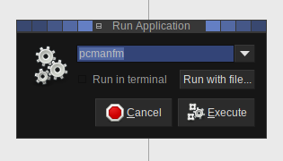

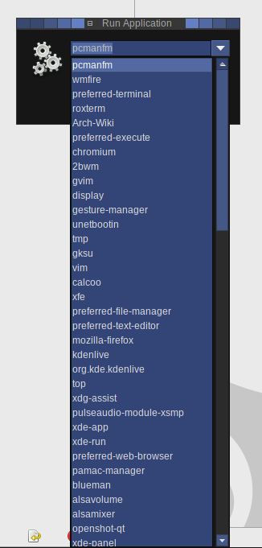

xde-pager
---------------

xde-places
---------------

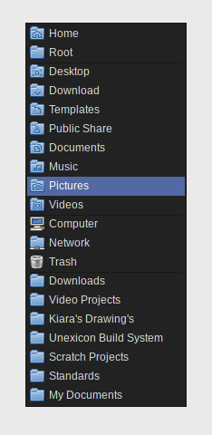

xde-recent
---------------

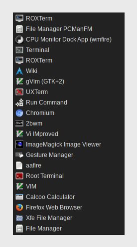

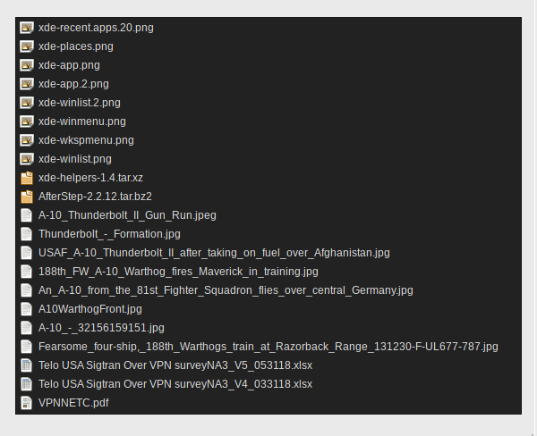

xde-run
---------------

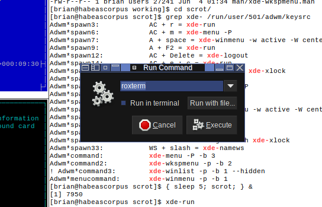

xde-winlist
---------------

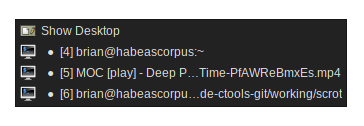

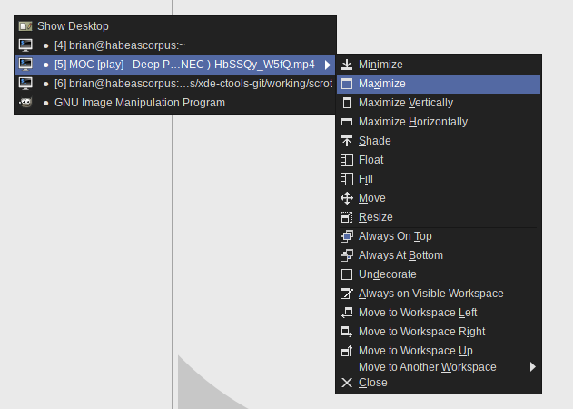

xde-winmenu
---------------

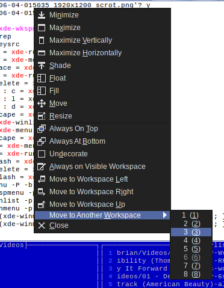

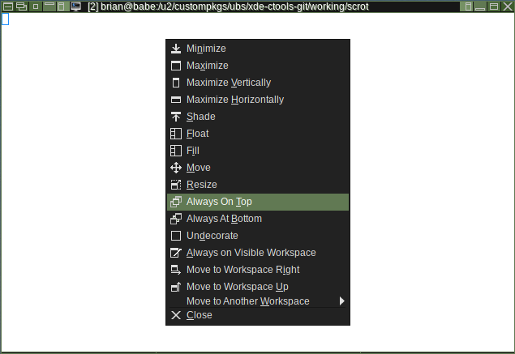

xde-wkspmenu
---------------

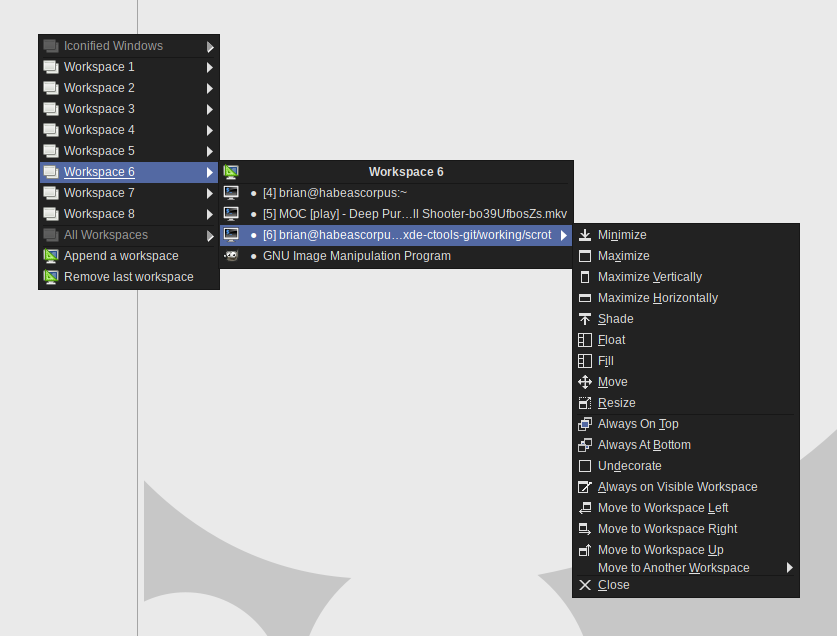

[ vim: set ft=markdown sw=4 tw=72 nocin nosi fo+=tcqlorn spell: ]: #
