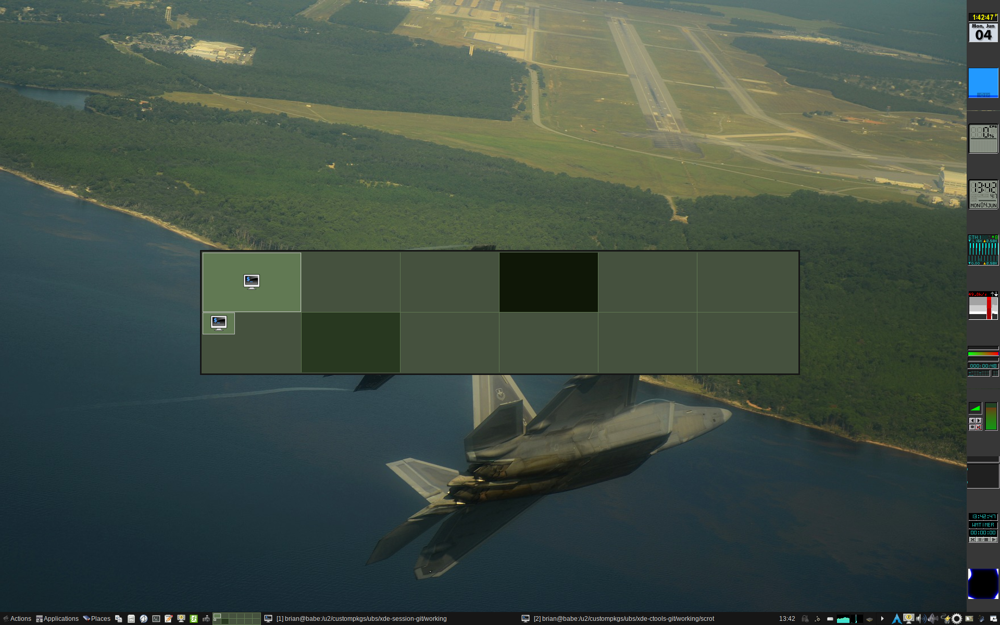

Sample Screenshots
===============

xde-app
---------------

Following are some examples of the ``xde-app`` application.

xde-pager
---------------

xde-places
---------------

xde-recent
---------------

xde-run
---------------

xde-winlist
---------------

xde-winmenu
---------------

xde-wkspmenu
---------------

[ vim: set ft=markdown sw=4 tw=72 nocin nosi fo+=tcqlorn spell: ]: #
